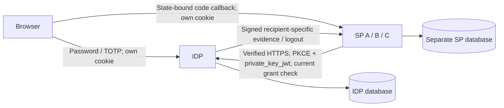

# Federated Identity — Product Security Take-Home

A Python 3.12/FastAPI IDP and two independent SPs implement OIDC Authorization
Code + S256 PKCE using Authlib, joserfc and cryptography. Alice/Bob sign in at the
IDP; each SP establishes its own server-side session from recipient-specific,
cryptographically verified and authoritatively recorded evidence. PostgreSQL,
async SQLAlchemy/asyncpg, Pydantic and strict typing keep API/service/storage
boundaries explicit. SP C is an optional live-onboarding profile.

## Built and consciously cut

| Property | Delivered behavior | Evidence |
| --- | --- | --- |
| Cross-SP integrity | Exact client/callback/state/nonce/PKCE and token-purpose binding; independent cookies/databases | [Login](docs/phase2.md) |
| Mutual authentication/onboarding | Verified TLS + endpoint-bound `private_key_jwt`; live operator registration | [Onboarding](docs/phase4.md) |
| Live signing-key rotation | Publish before activation; retain old verification keys through recorded expiry/skew | [Rotation](docs/phase5.md) |
| Compromise containment | Both signer and SP recovery paths; current authority overrides cached signatures | [Containment](docs/phase6.md) |
| Session lifecycle | Server expiry, local/global logout and recipient-scoped revocation | [Lifecycle](docs/phase3.md), [logout](docs/phase8.md) |
| Persistence/at-rest handling | Durable keys/registry/sessions; hashed opaque verifiers and purpose-bound encryption | [Foundations](docs/phase1.md) |

Selected extensions: rotating refresh and real re-authentication, reliable single
logout, password/TOTP step-up, and feature-specific attack defenses/tests
([renewal](docs/phase7.md), [step-up](docs/phase9.md)).

**Conscious cut: Phase 10's expanded attack-evidence package and optional
real-finding CI demonstration.** The brief permits [reasoned cuts](take-home-requirements.md#scope-and-time).
We prioritize runtime trust/lifecycle depth and demonstrated recovery. A credible
known-advisory negative control needs isolated vulnerable input, checked finding
identity and failure propagation; a nominal scanner command would overstate that
proof. Existing CI includes tests and `pip-audit` with `pipefail`, but no such
negative control or dedicated machine-readable audit evidence. We own that
pipeline-assurance gap. [Scope decision](docs/decisions/0005-phase10-scope-cut.md).

## Start and try it

Prerequisites: Docker with Compose, `make`, and free local ports 8443–8446. From
the repository root:

```bash
make up
make export-ca > federation-local-ca.crt
docker compose exec -T idp /app/.venv/bin/federationctl seed-credentials --username alice
```

Import the exported **public development CA** into your browser's trusted roots
before browsing. Bootstrap generates stable identities/credentials, initializes
separate databases/roles, and applies migrations. The explicit credential command
prints Alice's initial password; normal startup does not.

| Service | URL |
| --- | --- |
| IDP / operator plane | `https://idp.localhost:8443` / `/admin` |
| SP A | `https://sp-a.localhost:8444` |
| SP B | `https://sp-b.localhost:8445` |

1. At A select **Sign in** and enter Alice's credentials at the IDP.
2. At B select **Sign in**: SSO creates a different local session without another password.
3. Inspect `/account`; try **Sign out locally**, **Revoke application access**, or **Sign out everywhere**. Global logout confirms the current IDP browser and ends its matching federation session.
4. Import Alice's enrolled authenticator URI, then use **Step up authentication** and **Sensitive operation** at A:

```bash
docker compose exec -T idp /app/.venv/bin/federationctl totp-provisioning --username alice
```

That owner command intentionally exports the selected TOTP secret for enrollment.
Step-up requires actual password/code proof; an established B session keeps its
own assurance. Refresh preserves `auth_time` and cannot make stale MFA recent.

`make down` preserves data/secret volumes. After updates, use `make down` then
`make up` to apply initialization/migrations. [Runtime/trust setup](docs/runtime.md)
covers browser trust, prerequisites, backup/recovery and the process-only verifier.
[Operator and reproducible scenarios](docs/scenarios.md) cover C onboarding,
rotation, both containment paths and delivery recovery.

## Key decisions and uncertainty

- **Mutual trust:** SPs pin the configured HTTPS issuer/endpoints and public JWKS;
  the IDP pins registered RSA client keys. TLS, issuer signing and client-auth
  keys are distinct. Tokens cannot select a key URL or authenticate user/admin endpoints.
- **Keys:** persisted prepared/active/draining/retired/revoked states and encrypted
  private custody. Signer selection, exact issuance and retention commit together;
  emergency revocation is authoritative even with a warm SP cache.
- **Sessions/data:** host-only Secure/HttpOnly opaque cookies, separate SP state,
  immutable event/grant lineage, hashed access/refresh verifiers at the IDP, and
  encrypted recoverable SP credentials. OTP consumption and stronger events commit
  atomically; logout uses a leased encrypted outbox and durable issuer/sid receipts.
- **Calls to revisit:** Authlib's synchronous-shaped hooks run through an isolated
  async SQLAlchemy bridge and one short IDP security gate—simple to audit, but a
  compatibility/throughput bottleneck. Fresh online grant/logout checks give strong
  revocation semantics at the cost of IDP/database availability. An ambiguous refresh
  intentionally requires fresh authorization rather than retrying a consumed token.

[Architecture/data contracts](docs/architecture.md), [security model](docs/shared-security-model.md)
and [decision records](docs/decisions/) explain these choices.

## Threat model and data flow



Weighed malicious siblings, captured/substituted cookies/JWTs, replay/login-CSRF,
forged signing evidence, network impersonation, read-only data disclosure, and
failure/race adversaries. Purpose/recipient binding, verified TLS, canonical
issuance, atomic one-use records and scoped containment provide tested defenses.

Accepted limits: host/code execution or writable IDP database compromise is outside
these controls; TOTP is phishing-sensitive; the development CA and owner secret
volumes are trusted assets. Dependency outage blocks protected access, and already-
authorized in-flight work cannot be recalled. Security/throttle history has no
production cleanup worker. A clean dependency scan does not prove the skipped CI
negative control or exhaustive attack coverage. [Detailed threat model](docs/threat-model.md).

## Verification and AI usage

```bash
uv sync --frozen
make check
make test TESTS="tests/e2e/test_system_acceptance.py"
```

Tests require PostgreSQL server binaries, Playwright Chromium/system dependencies
and `certutil`; [setup and selected commands](docs/runtime.md#verification-without-a-docker-daemon).
The last full regression passed **565 tests**; Phase 11 passed **84 selected
acceptance cases** with exact results in [the checkpoint](docs/phase11.md). Real processes
and Chromium retain certificate verification and use injected time for expiry.
CI also configures Compose and installed-wheel checks. Local environment limitations
and observed startup/restart results are stated in that checkpoint.

I laid out the initial plan in target-architecture.md that I researched beforehand with
some AI assistance and used AI to format my document officially. I specifically wrote the
document to focus on the development of lengthy test cases and included exit conditions
so that the AI would have to ensure a certain level of quality across every phase I envisioned.
AI helped with primary-spec/library inspection, scaffolding, layered transactions,
hostile tests and documentation. Corrections included Authlib/HTTPX response and
exception differences, browser Origin/CSP redirects, supplied snapshots lacking
canonical authority, and shared test fixtures leaking rate budgets. Real PostgreSQL,
TLS/Chromium, failure injection, strict typing and a reproduced/full repaired run
caught them. The scope cut was explicitly user-directed. [Actual AI log](docs/ai-usage.md).
