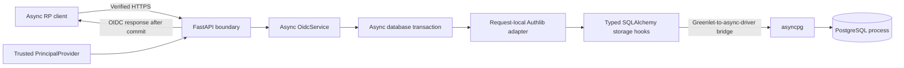

# Architecture — deployed protocol and shared security model

The deployed topology is documented in [target architecture](target-architecture.md)
and [runtime setup](runtime.md). Section 2's [shared security model](shared-security-model.md)
adds persisted event/grant lineage, lifecycle policy, and IDP/SP security service
operations. Three separate FastAPI processes use independent settings, secrets,
databases, and roles. The protocol adapter now joins the normalized model in
one gated transaction, verified by the [revisited Phase 0 checkpoint](phase0.md).
The [Phase 2 checkpoint](phase2.md) connects seeded credentials, IDP cookie
principals, and browser-bound SP callbacks to that same authoritative lineage.
The [Phase 3 checkpoint](phase3.md) adds user-facing session termination and
grant revocation, endpoint-scoped client revocation, and authenticated code-replay
containment with retained proof.
The [Phase 4 checkpoint](phase4.md) supplies a separate operator trust boundary,
live versioned client metadata, and C onboarding without IDP redeployment.
The [Phase 5 checkpoint](phase5.md) adds persisted active-signer selection,
public-before-active rotation, all-purpose retention, and bounded SP JWKS refresh.
The [Phase 6 checkpoint](phase6.md) completes atomic signer containment and
scoped SP containment with durable credential-replacement barriers and owner deployment.
The [Phase 7 checkpoint](phase7.md) adds rotating refresh with immutable renewal
evidence, database-claimed SP installation, and credential-backed re-authentication.
The [Phase 8 checkpoint](phase8.md) adds browser-matched RP-Initiated Logout,
leased signed delivery, current logout-purpose authority, and durable SP termination/replay.
The [Phase 9 checkpoint](phase9.md) adds actual password/TOTP proof, durable
replay/attempt budgets, and independent sensitive-operation assurance/recency.

Phase 10's additional attack-defense evidence/security-CI expansion is an
intentional submission scope cut. The optional real-finding negative-control
demonstration is not claimed complete. Existing feature checkpoints and the
configured checks/audit workflow support the chosen implementation; Phase 11
acceptance concerns that implemented scope. [ADR 0005](decisions/0005-phase10-scope-cut.md)
records the rationale and unverified pipeline-assurance boundary.

[Phase 11](phase11.md) closes selected-scope acceptance with one combined real
HTTPS/Chromium deployment, infrastructure/application restart and pending-work
recovery, the five race families, and fresh isolated installed-runtime probes.
Cold socket failures now map to session-preserving dependency unavailability, and
pool pre-ping recovers stale infrastructure handles. The concise README and
[scenario guide](scenarios.md) provide the final reviewer/operator working set.

## Trust anchors

1. The RP is configured with one exact HTTPS issuer.
2. Metadata must name that issuer's configured authorization, token, JWKS, introspection, revocation, and end-session endpoints.
3. The IDP authenticates a client using its registered public RSA key.
4. Every issuer signing key is distinct from client authentication keys, including prepared and historical trust.
5. The authenticated principal comes from `PrincipalProvider`, a trusted IDP-side boundary.

The standalone protocol factory defaults to `NoPrincipal`. The deployment
factory installs a principal provider that resolves only the IDP's own opaque
cookie to a persisted, active, credential-backed authentication event. Password
verification is Argon2id, and session/event/browser binding commits together.
The Phase 0 probe separately injects a persisted fixture event with its own
assurance class; it cannot satisfy password or MFA policy.

## Layering

FastAPI owns input parsing and responses. Pydantic constrains the wire and
domain data. `OidcService` owns async orchestration. `Database` owns connection,
session, commit, rollback, and disposal. The protocol adapter subclasses Authlib
extension points and uses its grants, PKCE implementation, and JOSE integration.

Each provider request creates its own adapter, grant extensions, credential
validator, and SQLAlchemy session. Private request state is not kept on a
shared authorization server. The RP likewise uses a request-local OAuth client
for exchange and a fresh client assertion.

## Transaction boundaries

Browser login:

1. Validate registration and the full authorization profile before persisting a login continuation.
2. Consume a short-lived form only with its initiating browser cookie and exact same-origin POST.
3. Verify Argon2id outside the database gate; lock/recheck the verified credential snapshot.
4. Commit the parent session, immutable event, and rotated encrypted IDP browser reference together.
5. Resume only the server-stored authorization parameters, revalidating them at code issuance.

Authorization:

1. Validate registration, exact callback, scope, state, nonce, and S256 profile.
2. Require a trusted authentication event and honor authentication-age demands.
3. Match that event against canonical persisted session/event facts and current parent state.
4. Generate an opaque code through Authlib; persist its one-way verifier and event/session link, clamped lifetime, callback, and proof.
5. Commit before publishing the redirect containing the code.

Token exchange:

1. Acquire the database security gate before any code/credential locks.
2. Verify the client assertion with its registered key and exact token-endpoint audience.
3. Atomically reserve `(client_id, jti)` through PostgreSQL's unique constraint.
4. Lock the owning client's code and recheck its canonical parent/event state.
5. Let Authlib validate the original callback and S256 verifier.
6. Begin an issuance savepoint; let Authlib generate/sign tokens using current persisted active trust.
7. Verify exact signed login facts with shared vetted policy; create canonical grant/evidence/hashed credentials and signer retention in the same session.
8. Link the protocol ledger to that grant, enforce lifetime ceilings, and commit before HTTP success.

Authenticated grant failures are OAuth response values, so the valid assertion
reservation commits after the issuance savepoint is rolled back. Unexpected failures, including signing or commit failures,
roll back the entire transaction. Assertions that fail verification never
reserve replay IDs. Code and access-token plaintext are absent from the database.

Introspection follows the same gated unit of work, using an independently
pinned introspection-endpoint assertion audience. The owning SP gets complete
active lineage; other clients, unknown/expired credentials, or revoked trust
yield no authority. RP exchange compares cryptographically verified login
evidence against this exact current lineage before returning `VerifiedLogin`.

Each SP binds its one-use authorization transaction to its own opaque cookie,
then consumes it before network exchange. `SpSecurityModel.establish_login()`
checks the exact verified evidence against fresh authenticated authority and
commits an independent local session with encrypted access custody. Protected
pages use that session and current grant state; JWT bearer headers never supply
an application or IDP principal.

Lifecycle confirmations have independent purpose-bound, encrypted targets and
one-use browser challenges. Local logout consumes intent and persists revocation
in one SP transaction. IDP termination joins its security gate, current cookie
principal, grant/family revocation, browser deletion, and outbox intents in one
transaction. SP grant revocation releases local locks before authenticating to
the IDP; remote failure retains local state.

SP establishment and back-channel termination share a database-owned issuer/sid
lock before browser/authentication rows. Local logout locks the browser binding
before its authentication row. Logout/rotation expire the old binding and discard
pending transactions and intents. A token exchange paused across local logout
cannot establish another session from the invalidated initiating cookie.

Consumed codes remain available beyond initial issuance expiry. Client
authentication, original callback, and PKCE validation precede replay containment;
only the correctly proven owning-client replay revokes the linked grant/family.
That intentional effect and assertion reservation commit before `invalid_grant`.

Operator credentials live outside the user directory. Session channels are
separate from IDP/SP cookie and JWT purposes; every registry operation checks
current account/credential epoch and explicit read/write permission. Browser
mutations consume purpose/target/cookie-bound intent in the same gated transaction
as metadata, audit, key history, and scoped grant invalidation. CLI sessions use
short-lived opaque bearer credentials, not SP assertions.

The live registry records approved destinations, implemented grants/scopes,
public-only authentication keys, and a monotonically increasing version. Codes
bind that version; old approvals cannot survive metadata/credential changes.
Registration and replacement keep issuer/client keys and client hostnames
distinct. Bootstrap provisions a separate encrypted operator bundle once and
preserves existing database policy/account state on reruns.

## Live signing and SP verification trust

`SigningKeyService` restores encrypted private material and current public trust
from the IDP database. Bootstrap supplies the known original identity for initial
enrollment; it does not select the active signer after rotation. Private envelopes
bind key ID and exact public identity and use the IDP's separate wrapping key.

Operator preparation generates RSA off-thread outside the gate, then rechecks
authority and commits prepared trust, encrypted custody, and audit. Public JWKS
contains prepared/active/draining keys and records irreversible publication only
after public-only validation. Activation requires that publication and the
expected previous active ID, then swaps states under the issuance security gate.

Token exchange assigns `SigningKeyService.active_in(work)` to its request-local
adapter inside the issuance savepoint. Actual signed evidence and
`record_signed_artifact_in()` join the same transaction. Retention covers the
maximum expiry across signed purposes plus protocol skew; routine retirement
does not revoke historical grants. Outbox claims now join this ledger for every
actual logout token, including expiry/containment-driven reissue.

Each SP's `IssuerJwksCache` pins `(issuer, JWKS URI, RS256)`. Discovery is checked
on each exchange; public keys are cached separately. Verified-HTTPS loading is
streamed and bounded to 32 KiB/16 public keys. One lock makes loads single-flight;
random unknown IDs share a refresh cooldown, including failed/cancelled attempts.
Expired cache entries require reload rather than stale outage fallback.

An unverified joserfc header supplies only a strict bounded kid hint before
unknown-key refresh. Token-supplied key URLs/embedded keys are rejected. The
normal signature/claims validation and exact authoritative evidence comparison
still precede local authentication. Bounded refresh intentionally trades retry
latency under spent budgets for bounded issuer network work.

## Compromise recovery boundaries

Operator signer containment joins the existing gate: recheck key capability and
purpose/target intent, validate expected active trust and a distinct usable
replacement, activate it when needed, revoke the target and its evidence-linked
grants/families, then append replacement-aware audit. No intermediate trust state
is published. Fresh SP checks override cached signatures; issuance/refresh cannot
revive a revoked lineage across the serialized decision.

SP containment disables the client, records its current `compromised_key_id`,
invalidates approvals through registration versioning, and revokes only its
grant/family authority. A database check/guard and service checks prohibit
reenabling that captured key or clearing the barrier. New public credentials
preserve disabled state, and explicit enable permits only fresh authorization.

The owning SP separately generates and atomically installs an encrypted
`client-identity.enc` under a private file lock and expected-kid check. The CLI
prints public registry metadata only. Startup verifies service binding and exact
private/public identity; it loads the replacement while preserving wrapping,
TLS, database, and browser/session custody. Operator registry authority never
receives the SP private key. Recovery cannot clear historical grant revocation.

## Persisted protocol data

Refresh retains the original grant/event/evidence. Authlib authenticates the
client and checks ownership/scope; the async service handles reuse containment
outside the issuance savepoint, then joins active signing, exact generated
credentials, predecessor consumption, successor ancestry, and signed evidence
inside it. Deferred completeness and immutable facts protect publication.

`credential_evidence` accompanies authenticated introspection for a renewed
access credential. SPs validate the new signed JWT against it while protected
session binding retains original evidence. Containment queries include keys used
for renewal as well as the root login key.

SP renewal claims commit under browser/authentication locks before verified
HTTPS, then release locks. Other workers wait for the same installation.
Completion checks current lifetime/revocation and exact attempt/generation.
Lost/cancelled/abandoned outcomes become permanently blocked for that session;
fresh authorization is the recovery path. Re-authentication has its own one-use
intent and retained prompt/max_age/time, and rotates the selected SP identifier
only after same-subject validated proof.

## Reliable single logout

`RpInitiatedLogout` validates GET/POST requests using the current IDP browser,
exact historical issued hints, and current registered return paths. Its sealed
one-use confirmation stores target/client/version/URI/state; live metadata and
cookie/session are rechecked in the revocation transaction. No hint becomes an
IDP principal. Original SP hints are sealed within immutable evidence custody.

Revocation, browser deletion, and per-recipient outbox intents commit together.
The lifespan-owned dispatcher claims bounded batches under the gate, selects
current signing material, signs off-thread, and commits retention/token/lease
before verified HTTPS. Leases recover crashes; fenced acknowledgements protect
newer workers. Network/service interruption receives capped backoff; terminal
failures retain private owner recovery through `federationctl logout-retry`.

SPs require the explicit logout-purpose JWT profile plus authenticated exact
issued/current trust at `/logout/introspect`, with a distinct assertion audience.
That check prevents unissued or revoked-key logout artifacts from taking effect
despite cached signatures. Dependency failures preserve local/queue state while
the ordinary protected-request authority already denies revoked grants.

One SP transaction expires issuer/sid matches and their browser bindings, removes
pending callbacks/intents, and commits immutable termination/receipt history.
Callback establishment shares the session lock/tombstone check; refresh finish
rechecks revocation. Exact retries acknowledge existing effects. A different sid
is independent of that history, even for the same subject. [Phase 8](phase8.md)
records lock ordering, policy defaults, migration, and actual browser recovery.
[ADR 0003](decisions/0003-session-scoped-durable-logout.md) records the delivery,
current-trust, and session-fencing decisions and their availability tradeoff.

## Persisted record inventory

Step-up extends validated authorization continuations with an explicit assurance
minimum. The actual password/TOTP path reserves source/browser/account budgets
before off-thread Argon2id, then joins credential/cookie/subject rechecking,
PyOTP matching, high-water consumption, immutable stronger event, and browser
rotation under the security gate. The original continuation deadline and failure
budget remain fixed. Factor secrets are subject-bound encrypted custody.

RP transactions retain expected subject, requested minimum and proof time.
Cryptographic/canonical evidence plus assurance/recency precede local rotation.
Sensitive approval performs online authority outside local locks, then checks
local lifetime/revocation and age before committing encrypted immutable evidence
with its purpose-bound intent. Refresh retains the original event; an established
sibling session does not change. [ADR 0004](decisions/0004-atomic-totp-step-up.md)
records the proof/consumption, budgets and RP-enforcement choices.

| Record | Purpose |
| --- | --- |
| `clients` | Enabled public-key registrations, literal callback allowlists, version, and captured-key recovery barrier |
| `authorization_codes` | Hashed codes, callback/PKCE/nonce, canonical event/session link, immutable facts and lifetime, consumption tombstone |
| `client_assertion_replays` | Client-scoped replay IDs and their validity deadline |
| `token_issuances` | Immutable protocol-to-canonical-grant link, hashed token verifiers, code, recipient, subject/session, and signing key |
| IDP `login_challenges` | Hashed one-use form and browser IDs, encrypted validated continuation, expiry |
| Each service's `browser_sessions` | Hashed opaque cookie identifiers and encrypted anonymous/authenticated references |
| SP `authorization_transactions` | Browser-bound, encrypted state/nonce/PKCE transaction, atomically consumed once |
| SP `sp_authentication_sessions` | Immutable local evidence, encrypted access/refresh custody, lifecycle, and durable renewal state |
| IDP `refresh_issuances` | Immutable signed generation, token/access/predecessor/successor binding and dates |
| IDP `refresh_credentials` | Hashed family/generation/predecessor state and irreversible consumption |
| IDP `signing_trust` | Immutable public identity, lifecycle, irreversible publication, and nonshrinking verification retention |
| IDP `signing_key_material` | Immutable issuer private envelopes, bound to public identity |
| IDP `signed_artifacts` | Immutable signed-purpose/recipient/issuance/expiry retention ledger |
| IDP `signing_audit` | Append-only operator signing lifecycle and replacement-aware containment history |
| IDP `logout_outbox` | Encrypted recipient intents/tokens, leases, attempts, backoff, fenced acknowledgement, and recoverable failures |
| SP `sp_logout_sessions` / `sp_logout_receipts` | Immutable issuer/sid termination and issuer/jti token-digest replay receipts |
| IDP `totp_credentials` / `totp_consumptions` | Subject-bound encrypted factors, irreversible counter high-water and immutable event-bound accepted steps |
| IDP `authentication_limits` | Durable source/browser/account reservation windows and attempt budgets |
| SP `sensitive_operations` | Immutable encrypted evidence of an authorized stronger/recent approval |

Consumed codes remain as tombstones. The shared model now normalizes
authentication events, grants, evidence, refresh families, trust state, and
logout intents in separate tables. Migration `idp_protocol_lineage_03` adds
composite bindings and a deferred complete-issuance constraint. Historical
unbound prototype records remain data, never redeemable authentication.

## Runtime boundaries

The integrated probe starts the deployment factories as three independent
HTTPS processes, with generated persistent-style key custody, official
migrations, and separate restricted PostgreSQL roles/databases over verified
TLS. It injects only an explicitly encrypted, owner-private fixture event into
the verification IDP process. Both RP clients use their owning SP's settings,
keys, and one-use browser transactions. Temporary ports also determine seeded
callback allowlists, avoiding divergence from deployed SP configuration.

Unit/protocol integration checks use disposable PostgreSQL databases over an
owner-private Unix socket. Real-network tests retain certificate/hostname
verification and do not change a host trust store.

Crypto operations use vetted libraries. Existing protocol RSA work is bounded;
logout signing/historical verification, expensive harness key/certificate
generation, and live operator key generation are offloaded. Password
hashing/verification is bounded and off-thread.
Volume key loading finishes before request serving; rotated database material is
decrypted off-thread when first needed. Provider hooks perform no synchronous
file or network operations.

`federationctl verify-login` uses real seeded passwords and the ordinary browser
routes in three independent HTTPS processes. Local-process back-channel DNS is
mapped explicitly by a verification-only transport while preserving SNI and CA
verification; Compose retains its normal configured service DNS aliases.

Phase 7's verification runtime also supports an owner-private clock file polled
asynchronously into memory. Protocol hooks read the injected Clock directly;
only the isolated process harness controls time advancement. Normal serving keeps
the existing clock boundary. The browser test verifies expiry/re-authentication
and restart over actual TLS without waiting whole credential lifetimes.
