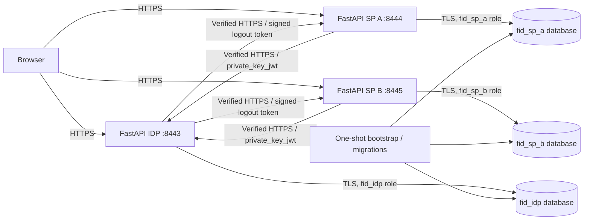

# Target architecture setup

The build order is **target architecture → shared security model → Phase 0 and
feature implementation**. Phase 0 now runs on this topology and canonical model.

## Installed topology

SP C is an optional Compose profile with its own key, TLS identity, role, and
database. It is initially absent from the IDP client registry.

## Section 1 coverage

| Architecture row | Current setup | Implementation boundary |
| --- | --- | --- |
| Application services | Independent IDP/SP factories and process entry point; two configured SP instances; optional SP C | Shared SP code, separate state/configuration |
| Federation protocol | Vetted code/PKCE/OIDC adapter and async RP client; encrypted browser-bound, one-use transactions; credential-backed SSO | Browser routes preserve canonical authentication and signing evidence |
| Service authentication | Distinct TLS certificates and persistent asymmetric client identities; public registrations seed into IDP DB | Actual SP code exchange and introspection use endpoint-bound assertions over verified TLS |
| Protocol/crypto libraries | Authlib, joserfc, cryptography, current HTTPX2 integration, PyOTP | No handwritten signing or crypto primitives |
| Persistence | Verified asyncpg TLS pools, separate roles/databases, IDP/SP Alembic histories | Application roles have no cross-database CONNECT or administrator privileges |
| Browser sessions | Opaque host-only cookies; encrypted payloads and hashed tokens in each service's own DB | Guests have anonymous storage; verified password/OIDC flows rotate into independent authenticated sessions |
| Revocation enforcement | Authenticated introspection and RP evidence binding against canonical grants | Exact endpoint audiences and recipient scope; dependency errors fail closed |
| Global logout | Browser-matched RP initiation, signed verified-HTTPS delivery, encrypted leased outbox, current logout-purpose checks, durable SP termination/replay | Revocation precedes notification; bounded recovery survives outage/restart |
| Step-up | Actual password/PyOTP proof, encrypted seeded factors, atomic accepted-step history, persistent throttling, OIDC minimum/recency, and sensitive SP approval | Stronger immutable events derive only from actual verified methods; each SP enforces its own current assurance/age |
| Runtime | Compose, per-service volumes, encrypted key bundles, generated CA, strict TLS, health/readiness, idempotent initialization | Deployment apps receive only their own secret volume |
| Verification | Type/lint checks, actual PostgreSQL/TLS processes, restart/isolation checks, real Chromium tests, audit command, CI workflow | CI config includes image/startup and dependency scanning; Phase 10's real-finding negative-control proof/evidence expansion is intentionally skipped |

## State and key custody

- Application identity and TLS private keys are encrypted PKCS#8, with owner-only secret files.
- Each service has a separate payload-encryption key and database password.
- Issuer identity keys, client authentication keys, and TLS keys are distinct.
- Live issuer rotation stores new private keys in immutable IDP database
  envelopes using its separate wrapping key; the original volume identity stays
  stable and persisted active/draining trust survives restart.
- The CA private key belongs only to trusted bootstrap; public CA certificates
  are copied into each application's volume.
- PostgreSQL's server TLS key is owner-private to its container OS user.
- Application containers receive neither administrator database credentials nor
  another application's secrets. PostgreSQL data and key volumes survive `down`.
- Existing key/password bundles are preserved during bootstrap reruns. Incomplete
  bundles and unexpected existing role privileges/owners cause explicit failure.

The session/transaction/outbox schemas supply generic infrastructure. The
[shared security model](shared-security-model.md) now adds normalized lineage,
policy, authenticated-session storage, and transactional lifecycle operations.
The [Phase 0 revisit](phase0.md) now binds code redemption and introspection to
that model. [Phase 2](phase2.md) adds one-use credential forms, opaque IDP cookie
principals, SP callbacks, authenticated pages, and cross-SP browser integrity.

## Verification performed

Recorded on 2026-10-05: **93 tests passed**, including the retained 81 protocol
checks and the new architecture/browser checks. Locked runtime dependencies
reported no known vulnerabilities. Compose configuration validation passed.

The architecture probe starts the same IDP/SP process entry points used by the
deployment and an actual TLS/password-authenticated PostgreSQL process. Tests
verify database access denial, opaque/encrypted state, bootstrap stability,
application restart, preserved key IDs, transaction browser binding, and
one-time consumption. Chromium loads each HTTPS hostname with a CA installed
only in its isolated test profile; HTTPS errors remain enabled.

This environment has no Docker daemon. Compose configuration is checked with
the Compose CLI; container image/startup tests are included in CI. Local
real-process verification supplies executable evidence without claiming a
locally executed container deployment.

Regression verification on 2026-10-06 passed all **168 tests**, including these
architecture/browser checks and the new shared-model tests. The same
three-process architecture verifier passed after the second IDP/SP migrations
and security-model composition-root changes.

The Phase 0 revisit passed all **192 tests** on 2026-10-06, including the deployed
three-process protocol proof, both SP identities, authoritative introspection,
browser-bound callback storage, and canonical issuance. Temporary callback
registrations now match each SP's actual process origin.

Phase 2's real-process verifier exercises seeded-password sign-in at SP A and
password-free SSO at SP B. Chromium verifies the actual forms, return redirects,
authenticated host-only cookies, HttpOnly visibility, transplantation denial,
and SP restart using only its temporary trusted-CA profile.

Phase 5's grouped real-process checks verify public credential-safe output and
Chromium rotation/restart across the same independently configured services.
Both SPs recover warmed key caches without restart and existing cookies remain
usable. The process harness's bounded readiness window is 30 seconds after
observing startup just beyond its old 15-second limit in this WSL checkout.
See [Phase 5](phase5.md) for selected evidence and exact results.

Phase 6 reuses that topology for one combined browser containment/recovery proof.
The actual owner CLI installs encrypted SP A credentials; only A restarts during
client recovery and B stays usable. Issuer containment then overrides warmed
keys, and a real IDP restart preserves active/revoked trust and captured-cookie
denial. [Phase 6](phase6.md) records targeted results and recovery boundaries.

Phase 7's process proof verifies automatic encrypted refresh and genuine selected-
SP re-authentication over that topology. A verification-only background clock
polls owner-private atomic timestamps into memory, so expiry is injected rather
than waited out. Both cookies/history survive ordinary renewal; A alone rotates
after password proof, and renewal survives real SP/IDP restart. [Phase 7](phase7.md)
records exact targeted commands/results.

Phase 8 reuses the clock/topology for actual Chromium local/global controls,
offline-SP denial, IDP dispatcher restart, expired-token reissue, and idempotent
notification retries after fresh different A/B sessions and real SP restart.
[Phase 8](phase8.md) records selected evidence and private owner queue commands.

Phase 9 uses the same verified-TLS topology and injected process time for actual
authenticator provisioning, password/code proof, invalid/replayed codes, IDP/SP
restart, stale sensitive access after refresh, and established sibling isolation.
[Phase 9](phase9.md) records exact selections and secret-custody/attempt policy.

The submission deliberately skips the optional Phase 10 real-finding CI proof and
additional attack-evidence package. The existing workflow's scanner failure
configuration is not acceptance evidence from a known-vulnerable negative control.
[ADR 0005](decisions/0005-phase10-scope-cut.md) records the scoped rationale and
accepted assurance gap; implemented feature checks retain their recorded evidence.

[Phase 11](phase11.md) verifies selected properties together on four independent
HTTPS applications, actual PostgreSQL/TLS and trusted Chromium, including cold-
connection outage recovery, C onboarding, abandoned refresh, MFA and pending
logout across application/infrastructure restart. The current isolated wheel
passes both fresh login/protocol probes outside the checkout. Docker is unavailable
in the local WSL distro, so configured Compose CI and local process evidence are
explicitly distinguished; no local container startup success is claimed.
